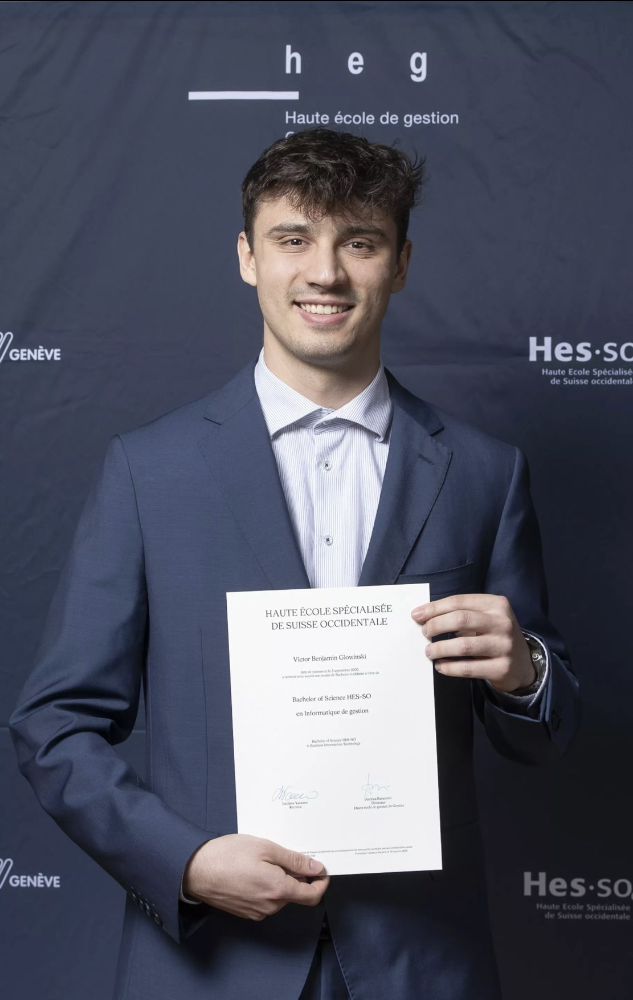

# Victor Glowinski — Portfolio

**Informatique de gestion** - **Bachelor of Science Haute Ecole de Gestion Genève** 
J’aime construire des produits utiles, bien structurés, et les relier au réel (données, métier, utilisateurs) — avec un gros intérêt pour la **sport-tech** et l’**IA**.

---

## 👋 À propos

Je combine une formation orientée **IT + business** avec des projets concrets (web, mobile, backend, DevOps).  
Mon fil rouge : transformer un besoin métier en une solution logicielle propre, testable, déployable, et agréable à utiliser.

**Centres d’intérêt :** triathlon · prévention des blessures · personnalisation · données & automatisation

---

## 🚀 Projets phares

### 🧠 KINESIS — Générateur de plans d’entraînement en triathlon assisté par LLM
Prototype d’application (mobile + backend) qui génère des plans personnalisés pour des triathlètes en reprise / prévention des blessures, en intégrant des données **physiologiques, médicales et personnelles**.

- **Objectif :** personnalisation + sécurité (progressivité, prévention, contraintes individuelles)
- **Fonctionnalités :** anamnèse, recommandations, logique de périodisation, génération de séances
- **Tech :** React Native · Backend **PHP (Laravel)** · API REST · MySQL/PostgreSQL (selon env) · Intégration LLM
- **Livrables :** mémoire de recherche + prototype + éléments de validation utilisateur

➡️ Repo(s) : <a href="https://github.com/Maxime-km/ProAgilis.git" class="btn"> https://github.com/VictorGlowinski/TravailBachelorVictorGlowinski.git </a>

---

### 🎮 ProAgils  (Serious Game Scrum) — Reprise & industrialisation d’une plateforme pédagogique
Reprise d’une plateforme web gamifiée pour l’apprentissage de **Scrum** (étudiants 1ère année HEG), initialement en phases validées par un professeur.

- **Mission :** rendre la plateforme accessible à tous simultanément (hébergement) + automatiser une partie du flux (retours, validation, accompagnement)
- **Tech :** Vue.js · Django · PostgreSQL · déploiement/ops sur environnement école

➡️ Repo : `scrum-serious-game` — <a href="https://github.com/Maxime-km/ProAgilis.git" class="btn">https://github.com/Maxime-km/ProAgilis.git</a>

---
### 🏃 HealthRun — Développement d'un client lourd
Prototype de client lourd qui permet de selectionner des plans sportifs personnalisés. Les utilisateurs peuvent poster leurs activités et y laisser des commentaires.

- **Objectif :** personnalisation de plans sportifs selon les envies de l'utilisateur
- **Fonctionnalités :** Ajout, modification, lecture et supression de données en base
- **Tech : Frontend ** C#/.NET · Backend **PHP (Laravel)** · API REST · MySQL · XAMPP
- **Livrables :** Modèle logique de données · Frontend · Backend · Vidéo démonstrative du Frontend

➡️ Repo(s) : `Projet HealthRun` — <a href="https://github.com/VictorGlowinski/HealthRun.git" class="btn">https://github.com/VictorGlowinski/HealthRun.git</a>

---

### ⚙️ DevOps & Cloud — CI/CD, conteneurs et observabilité (projets académiques)
Mise en pratique de pipelines et d’outils d’industrialisation autour de projets web.
Voici un descriptifs des outils utilisés en cours et comment nous les avons utilisés :
- **Ansible** : Les exercices consistent à écrire un playbook qui installe Nginx, le versionner dans un projet “Ansible” (fichier exercice1.yaml), puis créer un inventaire listant des VPS et exécuter le playbook. Ensuite, on enrichit le playbook (variables, boucles, handler + template de conf Nginx) et on lance l’exécution via une pipeline CI/CD (avec IP publique et firewall côté VPS).
- **ExerciceCICD** : Les exercices demandent de créer un projet “CI-CD-1” sur GitLab avec une branche par exercice, en fournissant Dockerfile/docker-compose.yml, gitlab-ci.yml et un README, puis de builder une image Docker et la pousser dans le registry du projet. Ensuite, on fait évoluer la pipeline pour déployer l’image sur un serveur Linux via SSH, puis pour une version multi-conteneurs (app + db) déployée via docker-compose. 
- **ExerciceDocker** : Les exercices te font créer un projet “Dockers” (une branche par exercice) et démarrer par la création d’une image via Dockerfile (Apache + page HTML), puis la gestion des tags/versions et le push d’images vers un registre. Ensuite, tu pratiques les volumes (données hors conteneur), les réseaux Docker (WordPress + MariaDB) et un docker-compose.yml pour lancer une application multi-services.
- **Kubernetese** :  Installation de Minikube et kubectl, puis exploration du cluster (nodes/pods/services) et du dashboard. Ensuite, on déploies une app via deployment.yaml + service.yaml, puis on teste l’accès, le scaling et les mises à jour.
- **Monitoring** (Promotheus & Grafana) : L’exercice demande de créer un projet “Monitoring” et d’écrire un docker-compose.yml qui déploie Prometheus, Grafana et un Node Exporter. Ensuite, on configure Prometheus pour scraper les métriques, puis Grafana pour les visualiser avec au moins un dashboard “système” et un dashboard “docker”.
- **Déploiement :** environnements cloud chez Hidora

➡️ Repo : `devops-labs` — <a href="https://github.com/VictorGlowinski/DevOps.git" class="btn">https://github.com/VictorGlowinski/DevOps.git</a>

---

## 🧩 Compétences

**Développement**
- Frontend : JavaScript/TypeScript · **Vue.js** · C#/.NET · React Native · UI/UX pragmatique 
- Mobile : **React Native**
- Backend : **PHP (Laravel)** · Python (Django) · Java (SpingBoot & Quarkus)· APIs REST
- Données : SQL · **PostgreSQL / MySQL / PL/SQL** · modélisation relationnelle & non relationnelle · MongoDB · Neo4j · Redis
- DevOps : Docker · Ansible · Kubernetese · Git · Promotheus & Grafana

**Qualité & collaboration**
- Git (workflow, branches, PR) · revue de code
- Tests (selon projets) · documentation · approche itérative
- Sens produit : priorisation, clarté, simplicité
- Analyse d’application existante
- Développement web, mobile et logiciels
- Reprise et amélioration de plateforme web
- Déploiement et exploitation d’applications sur des serveurs distants
- Automatisation de processus métier
- Génération de programme sportif pour le triathlon via LLM
- Conception d’architecture
- Analyse des besoins clients
- Etablissement de documentation
- Pratique DevOps

**Langues**
- Français · Allemand · Anglais (B2)

---

## 🎯 Ce que je recherche
Un poste **junior** (stage/graduate/1er emploi) où je peux :
- livrer en **full-stack** (front + back) et progresser vite,
- travailler avec de bonnes pratiques (CI/CD, tests, code review),
- contribuer à des projets utiles, idéalement dans un environnement technique stimulant (banque/IT, produit logiciel, sport-tech, etc.).

---

## 💼 Expérience
**Personnel de salle — Victoria Hall & Casino Théâtre (Genève)**  
Accueil, orientation, gestion du flux, coordination avec l’équipe, respect des consignes de sécurité et qualité de service.

---

## 📫 Contact
- LinkedIn :  <a href="www.linkedin.com/in/victor-glowinski" class="btn"> www.linkedin.com/in/victor-glowinski </a>
- Email : <a> victor.glwns@gmail.com  </a>
- CV :<a href="cv/CV - Victor Glowinski.pdf" class="btn"> Télécharger mon CV </a>

---

## 🗂️ Navigation rapide (repos)
- `kinesis-mobile` — app mobile
- `kinesis-backend` — API + logique métier
- `kinesis-thesis` — mémoire / docs
- `scrum-serious-game` — plateforme pédagogique
- `devops-labs` — CI/CD, Docker, observabilité

---

## 📝 Notes
Certains dépôts peuvent contenir des éléments académiques ou des données de démonstration.  
Si un projet t’intéresse et qu’il est privé, contacte-moi : je peux partager une démo ou des extraits.
